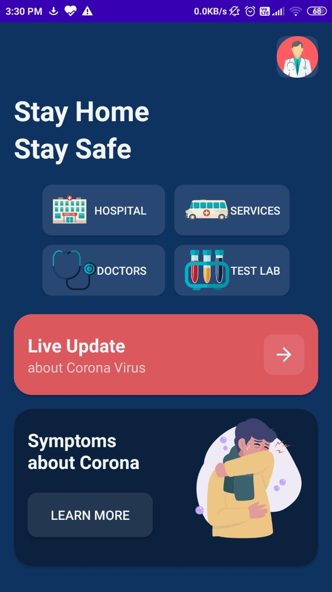
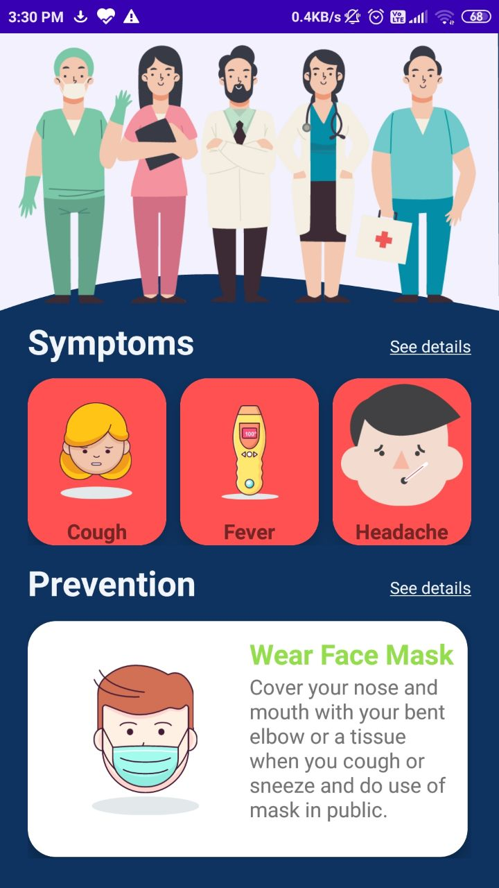
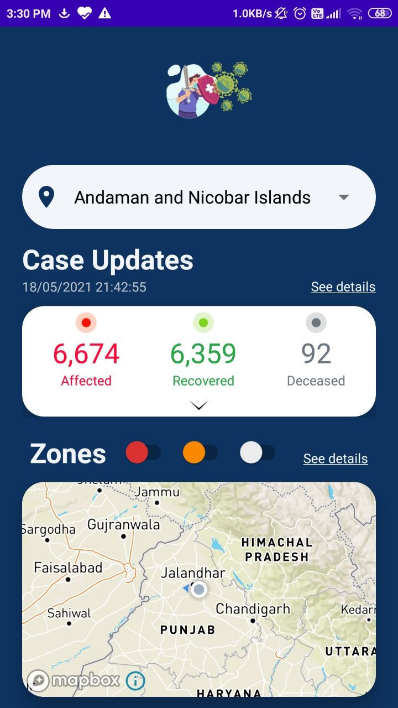
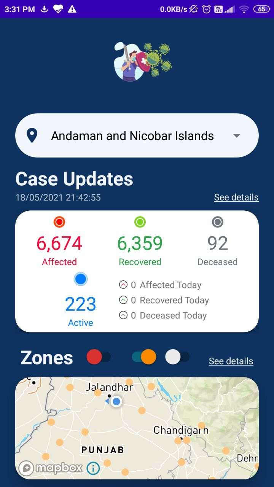
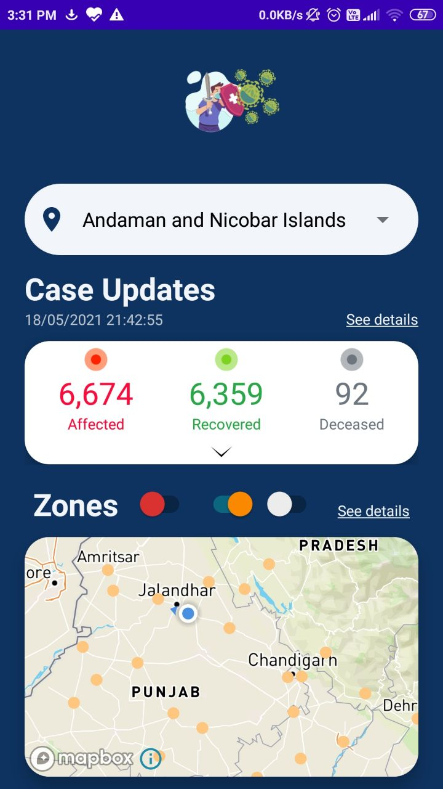
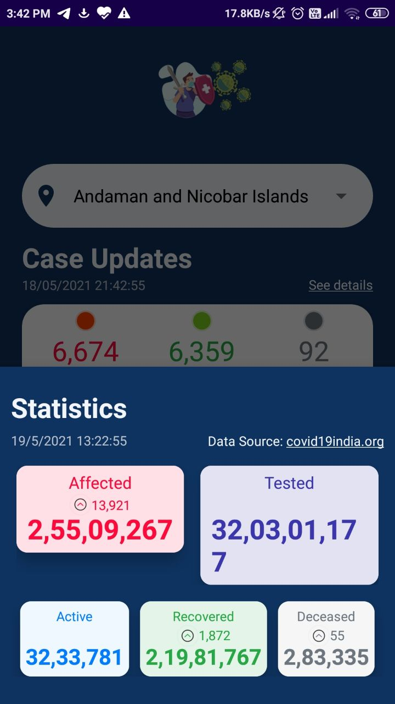

# *HealthAssistance*

### features af the app-
* Beautifull HomeScreen with dynamic colors and attractive icons.
* Attractive UI design.
* Animation integrated by LottieFiles.
* Symptoms and Precations page with animation.
* Case Updates Page with spinner to select states for detailed stats.
* Detailed stats include *Affected*, *Recovered*, *Deceased*, *Active* cases.
* It also update with daily cases. 
* Shows current location on Map with *Zones* update.
* Zones include *Red*, *Orange*, & *Green* and can be shown by switch button.
* Detailed Stats of india.
* Includes *Affected*, *Tested*, *Active*, *Recovered* & *Deceased* cases.
* Api library: Volley.
* Animation: Lottiefiles.

>with full UI design

#### Some Screenshots of this app

 Home Screen                                | Symptoms & Precaution                       | Live Update 			                         
:------------------------------------------:|:-------------------------------------------:|:-----------------------------------------------:
  |   |

 Case Update Expand                        | Zones Marker                                 | India Statistics                       
:-----------------------------------------:|:--------------------------------------------:|:-----------------------------------------------:
 | |
